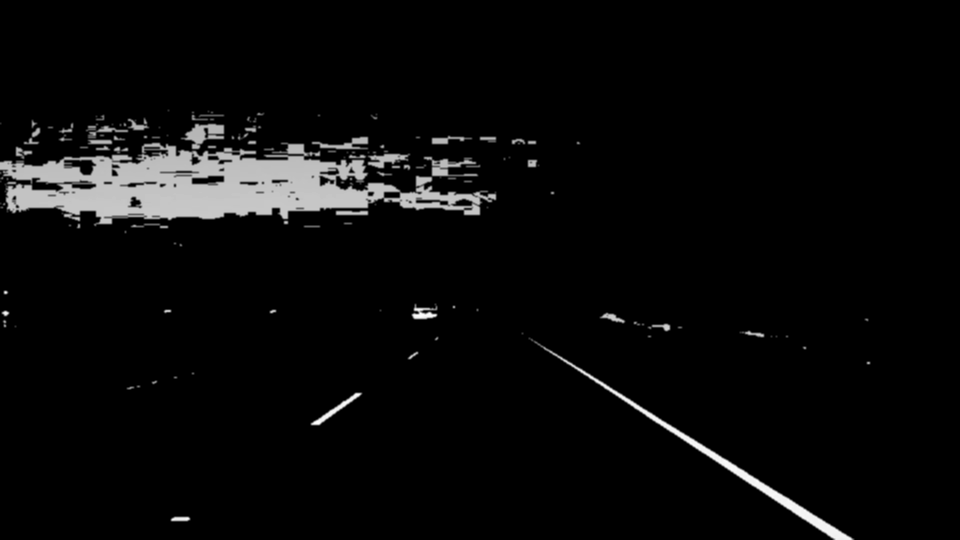
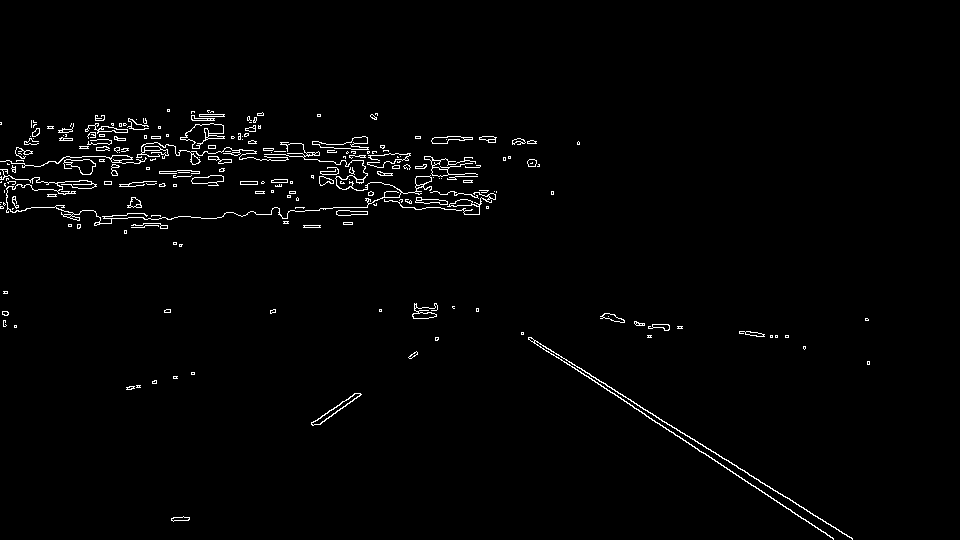
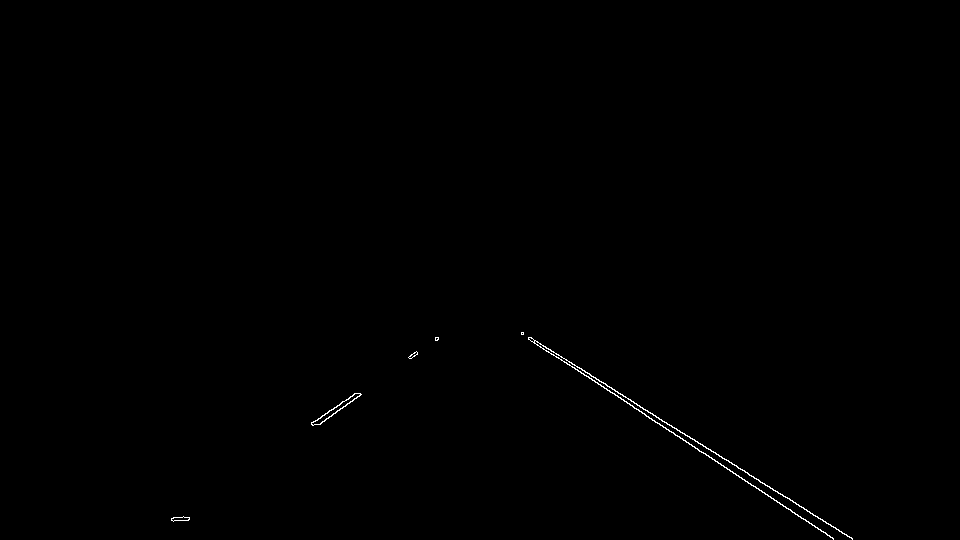
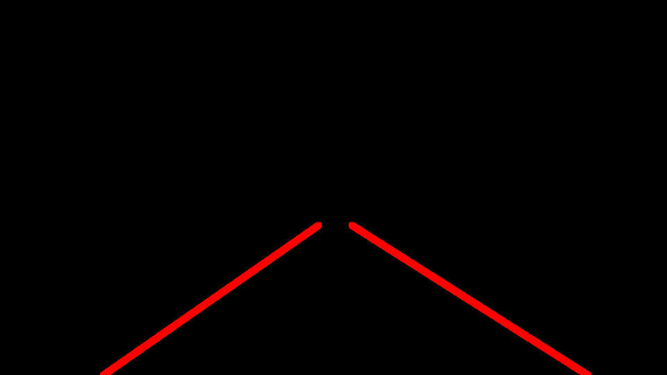
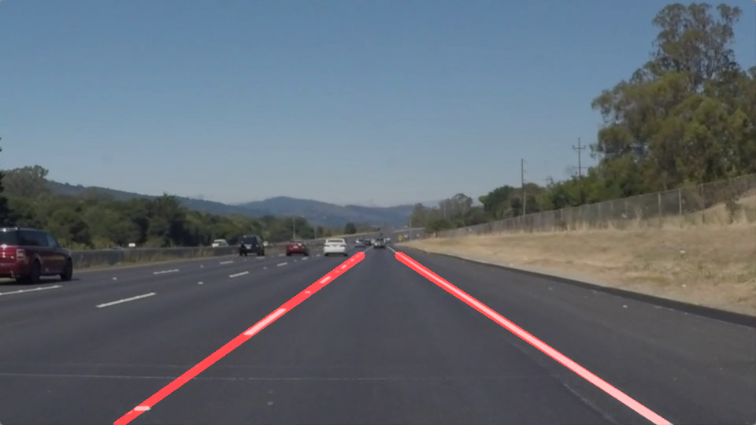

# **Finding Lane Lines on the Road** 

Overview
---

When we drive, we use our eyes to decide where to go.  The lines on the road that show us where the lanes are act as our constant reference for where to steer the vehicle.  Naturally, one of the first things we would like to do in developing a self-driving car is to automatically detect lane lines using an algorithm.

In this project you will detect lane lines in images using Python and OpenCV.  OpenCV means "Open-Source Computer Vision", which is a package that has many useful tools for analyzing images.  

Input image
---

Gray Image
---
grayScale function converts rgb image to gray scale image. It first converts image to HSV color space, extracts yellow-white region from image and then convert image to gray scale.
output of grayScale:

Blur Image
---
To remove noise from image, Gaussian fileter with kernel size 3 is used to smooth image.
output of gaussian_blur:

Detecting edges in image
---
Canny operator is used to detect edges im image. Canny operator performs better than sobel operator.
output of Canny operator:

Region of interest:
---
Use polygon of appropriate dimension to select region of interest, currently region of interest is hardcoded. 
output of ROI:

Hough lines from edges:
---
Hough function transforms all points in edge image to line in hough space, For each line count is increamented in approriate bins in hough accumulator, whichever bin has maximum votes we select that point in hough space. Since Point in Hough space corresponds to line in image space, we select line with maximum votes.

Threshold lines horizontal and vertical lines using slope of lines. Merge all lines whose slope is less than 0(left line) and all lines whose slope is greater than 0(right line). Take average of end points of left and right lines which give us new center for our left and right line. Maintain history of last n lines and centers to avoid bumpiness from frame to frame.
output of Hough line:

Merge original image and line image:
---
Output of blended image:

Potential shortcomings:
---
1. ROI is hardcoded and works fine for test videos, it should be computed dynamically.
2. Output lines are straight lines, might not work well on curvy road. Using second order polynomial function for road fitting will give better results.

Possible improvements:
---
1. Dynamically compute ROI
2. Use second order line fitting equation

Link to youtube vidoes:
---

